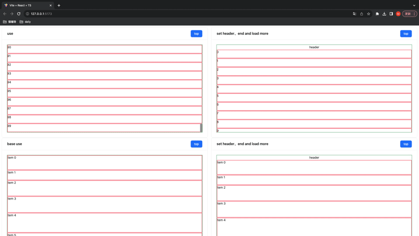
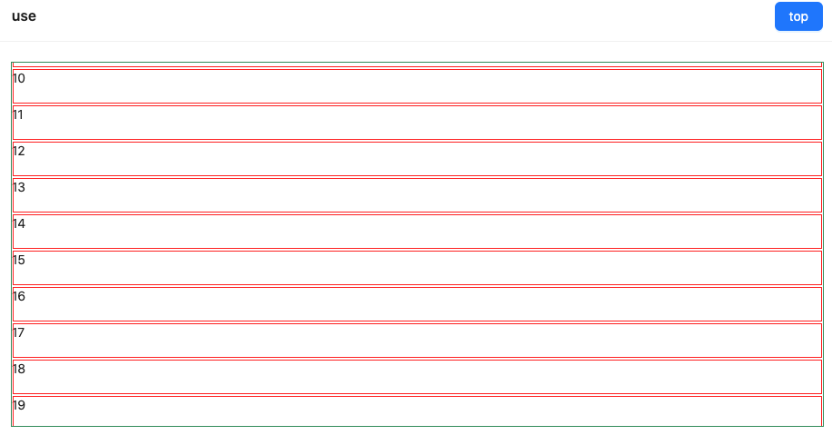
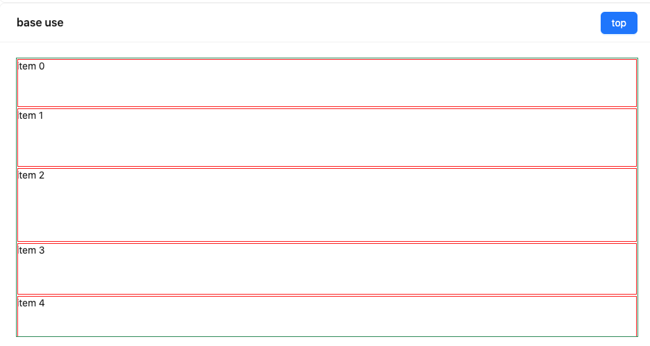
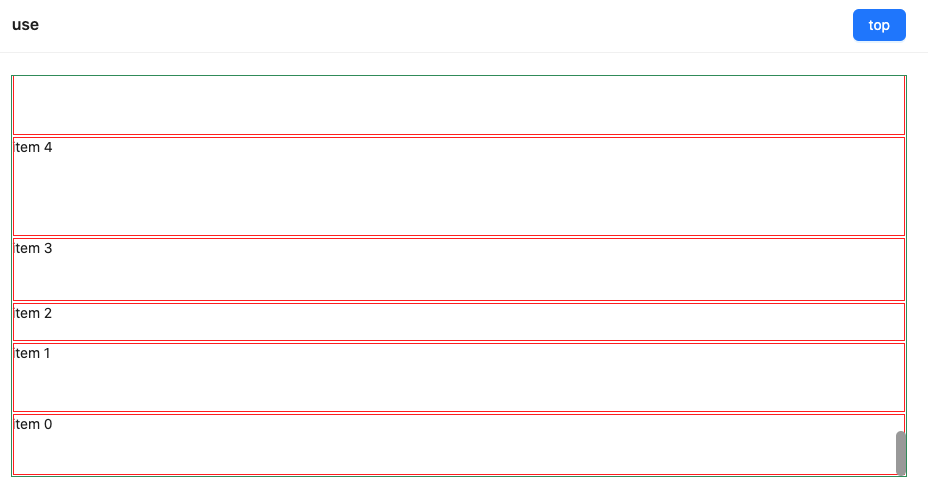

## react-auto-list

## this is [vue-auto-list](https://www.npmjs.com/package/wang-vue-virtual-list)



---


## fixed height



```javascript
import {VirtualList} from '.'
{list2.length && (
  <VirtualList<ItemType>
    list={list2}
    height={400}
    itemHeight={40}
    scrollToBottom={scrollToBottom}
    scrollToTop={scrollToTop2}
    itemKey="id"
    renderFooter={
      <div style={{ textAlign: "center" }}>loading...</div>
    }
    renderHeader={<div style={{ textAlign: "center" }}>header</div>}
    renderItem={({ index }: ItemType) => (
      <div
        style={{
          outline: "1px solid red",
          outlineOffset: -2,
          backgroundColor: "#fff",
          height: 40,
        }}
      >
        {index}
      </div>
    )}
  />
}
```

## auto size height



```javascript
import {AutoSizeVirtualList} from '.'
{list2.length && (
  <AutoSizeVirtualList<ItemType>
    list={list2}
    height={400}
    itemHeight={40}
    itemKey={"id"}
    scrollToTop={scrollToTop2}
    scrollToBottom={scrollToBottom}
    renderFooter={
      <div style={{ textAlign: "center" }}>loading...</div>
    }
    renderHeader={
      <div style={{ textAlign: "center" }}>header</div>
    }
    renderItem={({ name, height }: ItemType) => (
      <div
        style={{
          outline: "1px solid red",
          outlineOffset: -2,
          height: height,
          backgroundColor: "#fff",
        }}
      >
        {name}
      </div>
    )}
  />
)}
```

## auto reverse size height



```javascript
import {RevertAutoSizeVirtualList} from '.'
{list2.length && (
  <RevertAutoSizeVirtualList<ItemType>
    list={list2}
    height={400}
    itemHeight={40}
    itemKey={'id'}
    scrollToTop={scrollToTop2}
    renderFooter={<div style={{ textAlign: 'center' }}>拼命加载中...</div>}
    scrollToBottom={scrollToBottom}
    renderItem={({ name, height }: ItemType) => (
      <div
        style={{
          outline: '1px solid red',
          outlineOffset: -2,
          height: height,
          backgroundColor: '#fff'
        }}
      >
        {name}
      </div>
    )}
  />
)}
```

## APIS

| Prop           | Description                 | Type                   | Default |
| -------------- | --------------------------- | ---------------------- | ------- |
| list           | Data list                   | Array<T>               | -       |
| height         | list height                 | number                 | 400     |
| itemHeight     | list item height            | number                 | 40      |
| minSize        | show cnt                    | number                 | 20      |
| itemKey        | react keys                  | key in T               | -       |
| scrollToTop    | go to top                   | number                 | 0       |
| scrollToBottom | scrolled to bottom          | (e) => void            | -       |
| renderFooter   | render footer( not revert ) | ReactNode              | -       |
| renderHeader   | render header               | ReactNode              | -       |
| renderItem     | render item                 | (item: T) => ReactNode | -       |

可以把 git 代码拉取下来，运行 demo 查看更多配置
